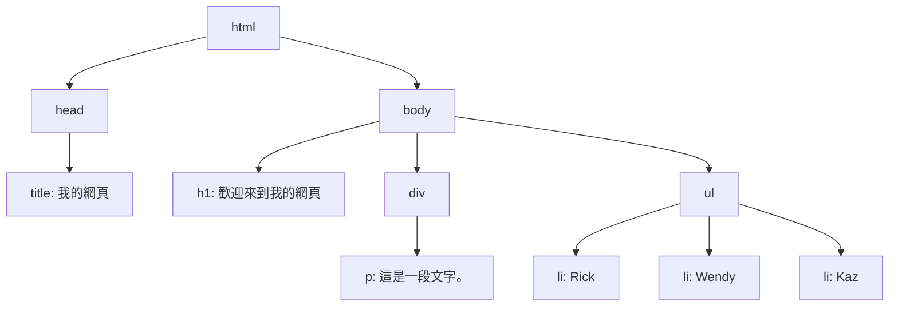
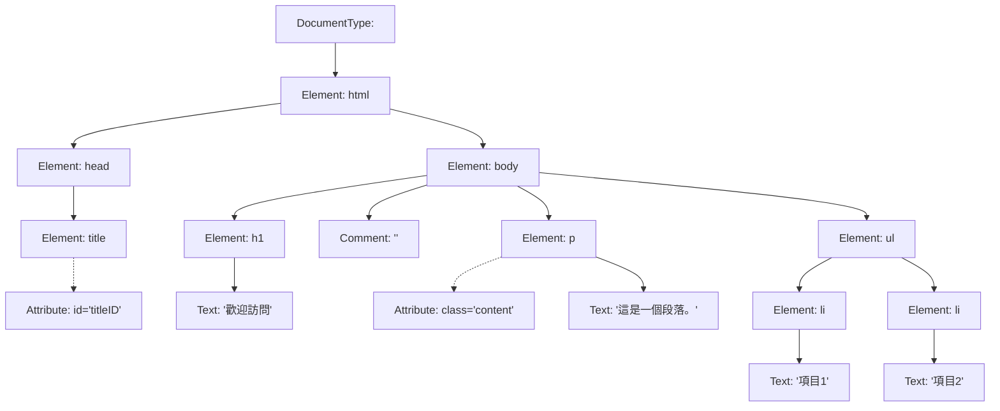

## What is DOM?
&emsp;&emsp;DOM 指的是「文件物件模型」(Document Object Model)。DOM 是一種跨平台和語言獨立的接口，它將 HTML 或 XML 文件表示為樹狀結構，其中每個節點代表文檔中的一部分（例如，標記、屬性、文本等）。

{:width="50%"}  

-   文件物件模型（ Document Object Model ），把各個標籤、文字、圖片等都定義成物件。
-   由 W3C(全球資訊網協會) 制定的一種規範，將 HTML 或 XML文件 解析為樹狀結構。
    -   **全球資訊網協會**為了確保不同瀏覽器可以按照一致的規則解析和顯示網頁，所以制定了一系列標準和規範。
-   在網頁開發中，網頁瀏覽器會將HTML文件解析成一個**樹狀結構**，每個元素（例如標題、段落、圖片等）都被表示為一個物件，這些物件可以被程式碼存取和修改。
-   可透過程式碼獲取和操作文件的內容和結構。
-   DOM（Document Object Model）是一個程式化的方式來表示和操作HTML、XML等文件的結構。
-   透過DOM，開發者可以使用程式語言（如JavaScript）來動態地修改網頁的內容和結構，實現交互性和動態效果。
-   DOM是一種用來**描述網頁文件結構**並**允許開發者通過程式碼來操作網頁元素**的機制。


&emsp;&emsp;使用 .NET 進行網頁爬蟲時，可以透過操作 DOM 來訪問和操作網頁的內容。這通常包括以下步驟：

1.  **解析網頁**：將網頁的 HTML 內容加載並解析成 DOM 結構。這可以使用如 Html Agility Pack 這樣的第三方庫來實現。
    
2.  **遍歷 DOM 結構**：一旦 DOM 結構被建立，您就可以遍歷它來找到您感興趣的元素。這可能包括搜索特定的標籤、類別或 ID。
    
3.  **提取數據**：從選定的 DOM 節點中提取所需的數據（如文本內容、屬性值等）。
    
4.  **操作和交互**：除了提取數據，您還可以通過 DOM 修改網頁的結構或內容，或模擬用戶與網頁的交互（如填寫表單、點擊按鈕等）。
    

&emsp;&emsp;了解 DOM 對於進行有效的網頁爬蟲至關重要，因為它是與網頁內容交互的主要方式。在 .NET 環境中，有許多工具可以幫助處理和操作 DOM，從而實現網頁爬蟲。

## 樹狀結構

&emsp;&emsp;樹狀結構（Tree Structure）是一種數據結構，它用來表示具有層級關係的數據。在樹狀結構中，數據以節點（Nodes）的形式組織，並且每個節點都可以有零個或多個子節點。這種結構類似於一棵倒置的樹，其中有一個根節點（Root Node），它是最頂端的節點，並且所有其他的節點都直接或間接地連接到根節點。

-   **樹狀結構**是一種階層關係的資料結構，每一個資料元素都稱為**節點（Node）**。
    -   根節點 (Root)：根節點具有唯一性，是整個樹狀結構最上層的樹根。
    -   枝 (Branch)：節點向下延伸擴展的所用到的枝。
    -   葉節點 (Leaf)：節點之下都沒有子節點稱為葉節點。

{:width="50%"}  


&emsp;&emsp;在 DOM（文件物件模型）中，樹狀結構用於表示 HTML 或 XML 文件的組織方式。這裡的每個 HTML 標籤都是樹中的一個節點，並且標籤之間的父子關係形成了樹的結構。例如：

-   根節點通常是 HTML 文件的 `<html>` 標籤。
-   `<html>` 標籤下面有兩個子節點：`<head>` 和 `<body>`。
-   `<head>` 和 `<body>` 標籤又可以有自己的子節點，比如 `<title>`、`<meta>` 在 `<head>` 中，而 `<div>`、`<p>` 等在 `<body>` 中。

&emsp;&emsp;這種樹狀結構使得訪問和操作文檔中的元素變得非常直觀和靈活。例如，如果你想要變更某個段落的文本，你可以先找到這個段落的節點（例如，一個 `<p>` 標籤），然後修改它的內容。由於每個元素都是樹中的一個節點，這使得透過程式碼遍歷和操作這些元素變得可能。


**範例:**

```html

<!DOCTYPE html>
<html>
<head>
    <title>我的網頁</title>
</head>
<body>
    <h1>歡迎來到我的網頁</h1>
    <div>
        <p>這是一段文字。</p>
    </div>
    <ul>
        <li>Rick</li>
        <li>Wendy</li>
        <li>Kaz</li>
    </ul>
</body>
</html>

```
在這個 HTML 文件中，DOM 的樹狀結構如下：

-   `html` 是根節點。
    -   `head` 是 `html` 的子節點。
        -   `title` 是 `head` 的子節點，包含文字 "我的網頁"。
    -   `body` 也是 `html` 的子節點。
        -   `h1` 是 `body` 的子節點，包含文字 "歡迎來到我的網頁"。
        -   `div` 是 `body` 的另一個子節點。
            -   `p` 是 `div` 的子節點，包含文字 "這是一段文字。"。
        -   `ul` 是 `body` 的另一個子節點。
            -   `li` 是 `ul` 的子節點，每個 `li` 包含 "Rick"、"Wendy" 和 "Kaz" 的文字。

**他的樹狀結構大概會長這樣:**  



## DOM節點種類
&emsp;&emsp;在 DOM（文件物件模型）中，節點（Nodes）可以分為幾種不同的類型。每種節點類型代表文檔結構中的不同部分和不同類型的信息。以下是一些常見的 DOM 節點類型：

1.  **元素節點（Element Node）**：
    
    -   這是最常見的節點類型。
    -   代表 HTML 或 XML 文檔中的元素（例如，`<div>`, `<p>`, `<span>` 等）。
    -   可以包含其他元素節點、文本節點、註釋節點等。
2.  **文本節點（Text Node）**：
    
    -   包含元素的文本內容。
    -   這些節點不包含 HTML 標籤。
    -   通常是元素節點的子節點。
3.  **屬性節點（Attribute Node）**：
    
    -   定義在元素上的屬性（如 `class`, `id`, `style` 等）。
    -   雖然在 HTML 中屬性看起來像是元素的一部分，但在 DOM 中它們被視為屬於元素的特殊類型的節點。
4.  **註釋節點（Comment Node）**：
    
    -   包含 HTML 或 XML 的註釋內容。
    -   這些節點不會在用戶端顯示，但對開發者來說是可見的。
5.  **文件節點（Document Node）**：
    
    -   代表整個文檔的根節點。
    -   每個文檔只有一個文件節點。
    -   它是 DOM 樹的最頂層節點。
6.  **文件類型節點（Document Type Node）**：
    
    -   表示文檔的 doctype 聲明（例如 `<!DOCTYPE html>`）。
    -   用於指定文檔類型和版本。
7.  **文件片段節點（Document Fragment Node）**：
    
    -   代表一個輕量級的文檔節點，可以包含多個子節點。
    -   用於在不影響文檔的情況下組合和操作節點。
8.  **處理指令節點（Processing Instruction Node）**：
    
    -   用於 XML 文檔，包含處理指令。
    -   在 HTML 中很少使用。

**以下是一個簡單的html結構**  
```html
<!DOCTYPE html>
<html>
<head>
    <title id="titleID">示例頁面</title>
</head>
<body>
    <h1>歡迎訪問</h1>
    <!-- 這是一個註釋 -->
    <p class="content">這是一個段落。</p>
    <ul>
        <li>項目1</li>
        <li>項目2</li>
    </ul>
</body>
</html>

```
**他的種類可以分成以下:**  


**在這個 Mermaid 圖中：**

-   **文檔類型（Document Type）** 表示為 `<!DOCTYPE html>`。
-   **元素節點（Element Nodes）** 如 `<html>`, `<head>`, `<title>`, `<body>`, `<h1>`, `<p>`, `<ul>`, `<li>` 等。
-   **屬性節點（Attribute Nodes）** 如 `id="titleID"` 和 `class="content"`，分別屬於 `<title>` 和 `<p>` 元素。
-   **文字節點（Text Nodes）** 表示各個元素的文本內容，如 "歡迎訪問" 和 "這是一個段落。"。
-   **註釋節點（Comment Node）** 表示為 HTML 註釋 `<!-- 這是一個註釋 -->`。


## Node之間的關係

{:width="50%"}  

&emsp;&emsp;在 DOM（Document Object Model）中，節點（Nodes）之間的關係可以用幾種不同的方式來描述。這些關係類似於家族中的關係，幫助我們理解如何在文檔的結構中導航和操作。以下是一些主要的節點關係：

1.  **父節點（Parent Node）**：
    
    -   每個節點（除了根節點）都有一個父節點。
    -   父節點是包含該節點的直接上級節點。
    -   例如，在 `<body><p></p></body>` 中，`<body>` 是 `<p>` 的父節點。
2.  **子節點（Child Nodes）**：
    
    -   一個節點可以有多個子節點。
    -   這些是直接包含在該節點內的節點。
    -   例如，在上面的例子中，`<p>` 是 `<body>` 的子節點。
3.  **兄弟節點（Sibling Nodes）**：
    
    -   擁有相同父節點的節點互稱為兄弟節點。
    -   例如，如果有兩個 `<p>` 元素都是同一個 `<div>` 的子元素，那麼這兩個 `<p>` 元素互為兄弟節點。
4.  **祖先節點（Ancestor Nodes）**：
    
    -   一個節點的父節點、父節點的父節點，依此類推，都是其祖先節點。
    -   在深層嵌套的結構中，這個關係特別重要。
5.  **後代節點（Descendant Nodes）**：
    
    -   一個節點的子節點，子節點的子節點，等等，都是其後代節點。
    -   這表示了一個節點下面所有層級的節點。

**這邊提供一個簡單的範例:**

```html
<!DOCTYPE html>
<html>
<head>
    <title>網頁標題</title>
</head>
<body>
    <div id="container">
        <h1>頁面標題</h1>
        <p>第一段落。</p>
        <p>第二段落。</p>
    </div>
</body>
</html>

```

**在這個 HTML 範例中，我們可以看到以下幾種節點關係：**

1.  **父子關係**：
    
    -   `<html>` 是 `<head>` 和 `<body>` 的父節點。
    -   `<div id="container">` 是兩個 `<p>` 元素的父節點。
2.  **兄弟關係**：
    
    -   `<head>` 和 `<body>` 是兄弟節點（因為它們共享同一個父節點 `<html>`）。
    -   兩個 `<p>` 元素是兄弟節點（因為它們都是 `<div id="container">` 的子節點）。
3.  **祖先關係**：
    
    -   `<body>` 和 `<head>` 是所有在它們內部的元素（如 `<div>`, `<h1>`, `<p>`）的祖先節點。
    -   `<html>` 是頁面中所有元素的祖先節點。
4.  **後代關係**：
    
    -   `<div id="container">` 的後代節點包括 `<h1>` 和兩個 `<p>` 元素。
    -   `<body>` 的後代節點包括 `<div>`, `<h1>`, 和所有的 `<p>` 元素。

## XML

XML（Extensible Markup Language）是一種用於存儲和傳輸數據的標記語言。它是自描述的，意味著它不僅包含數據，還包含有關數據的信息。XML 被廣泛用於不同的技術領域和應用中，因為它提供了一種標準化的方式來表示複雜的數據結構。

### XML 的主要特點：

1.  **自描述性**：
    
    -   XML 文件通常自包含，即它們描述了數據的結構和含義。
    -   標籤是用戶自定義的，使得信息組織更加清晰。
2.  **樹狀結構**：
    
    -   XML 數據被組織成一種樹狀結構，類似於 HTML 或其他標記語言。
    -   每個 XML 文件都有一個根元素，其他元素可以嵌套成多層結構。
3.  **可擴展性**：
    
    -   使用者可以創建自定義標籤，使 XML 非常適合於特定應用的數據表示。
    -   這使得 XML 非常靈活，可以用於各種不同的數據交換場景。
4.  **嚴格的語法規則**：
    
    -   XML 文件必須嚴格遵循預定義的語法規則，例如標籤必須正確地開啟和關閉。
    -   這保證了數據的一致性和可解析性。

### XML 與 HTML 的比較：

-   **目的不同**：
    
    -   HTML 主要用於顯示數據並定義數據的外觀。
    -   XML 主要用於描述和傳輸數據，不關心數據的顯示方式。
-   **標籤自定義**：
    
    -   HTML 的標籤是預定義的（如 `<p>`, `<div>` 等）。
    -   XML 允許創建自定義標籤，更適合特定應用的數據結構。

### XML 的應用場景：

-   **網絡服務**：XML 常用於 Web 服務和 API，作為數據交換的格式。
-   **配置文件**：許多應用程序使用 XML 來存儲配置信息。
-   **辦公軟件**：如 Microsoft Office 的某些版本使用 XML 格式存儲文檔。
-   **數據交換**：在不同系統之間交換複雜數據時，XML 提供了一種通用格式。

XML 由於其靈活性和自描述性，成為了跨平台和系統間數據交換的重要工具。


.NET 中使用 XML 相關類別的一些基本語法:

1.  **`xmlDoc.Load(URL)`**：
    
    -   這個方法用於從指定的 URL 加載 XML 文檔。
    -   `URL` 可以是文件的路徑或網絡地址。
    -   加載後，`XmlDocument` 實例 `xmlDoc` 會包含 XML 文檔的 DOM 結構。
    
```csharp
    XmlDocument xmlDoc = new XmlDocument();
    xmlDoc.Load("path/to/xmlfile.xml"); 
```

2.  **`xmlDoc.LoadXml(string)`**：
    
    -   此方法用於從一個字符串加載 XML 內容。
    -   這個字符串應該包含有效的 XML 數據。
    
```csharp
    XmlDocument xmlDoc = new XmlDocument();
    xmlDoc.LoadXml("<root><child>content</child></root>");
```    
3.  **所有的節點物件都是 `XmlNode`**：
    
    -   在 .NET 的 `XmlDocument` 類中，所有與 XML 相關的節點都被視為 `XmlNode` 類型的實例。
    -   這包括元素節點、文本節點、屬性節點等。
4.  **`XmlNode root = xmlDoc.DocumentElement;`**：
    
    -   此語句用於獲取 XML 文檔的根節點。
    -   `DocumentElement` 屬性返回 XML 文檔的根元素（最外層的元素）。
    
```csharp
    XmlNode root = xmlDoc.DocumentElement;
```
    
5.  **使用 `SelectNodes` 方法和 XPath**：
    
    -   `SelectNodes` 方法允許使用 XPath 查詢語言來選擇符合特定條件的節點集合。
    -   在使用 XPath 時，如果 XML 定義了默認的命名空間（xmlns），可能需要特殊處理才能正確選擇節點。
    
```csharp
    XmlNodeList nodes = root.SelectNodes("//elementName");
```    

&emsp;&emsp;這些是處理 XML 文檔的基本方法，在 .NET 環境中進行 XML 解析和操作時非常有用。這些方法和屬性使得在 .NET 中讀取、修改和查詢 XML 數據變得簡單直接。

### 補充

在 .NET 環境中進行網頁爬蟲時，對於處理 XML 數據，有一些常用的語法和類別可用於解析、查詢和操作 XML 文件。以下是一些主要的工具和方法：

1.  **`XmlDocument` 類**：
    
    -   用於加載和解析 XML 文檔。
    -   提供了訪問 XML 文檔結構的方法，例如 `Load`, `LoadXml`, `GetElementById`, 和 `SelectNodes`。
    
```csharp
    XmlDocument doc = new XmlDocument();
    doc.Load("path/to/xmlfile.xml");
    XmlNodeList nodes = doc.SelectNodes("/xpath/query");
```
    
2.  **`XPath` 查詢**：
    
    -   一種在 XML 文檔中查找信息的語言。
    -   與 `XmlDocument` 或 `XmlNode` 一起使用，可用於查找特定節點或節點集合。
    
```csharp
    XmlNode node = doc.SelectSingleNode("//element[@attribute='value']");
```
    
3.  **`XmlReader` 類**：
    
    -   提供了一種快速且低內存消耗的方式來讀取 XML 數據。
    -   適用於處理大型 XML 文件。
    
```csharp
    using (XmlReader reader = XmlReader.Create("path/to/xmlfile.xml"))
    {
        while (reader.Read())
        {
            // Process each node
        }
    }
```
    
4.  **`XmlWriter` 類**：
    
    -   用於生成和寫入 XML 數據。
    -   提供了多種寫入 XML 元素和屬性的方法。
    
```csharp
    using (XmlWriter writer = XmlWriter.Create("path/to/output.xml"))
    {
        writer.WriteStartElement("element");
        writer.WriteAttributeString("attribute", "value");
        writer.WriteEndElement();
    }
````
    
5.  **`LINQ to XML`**：
    
    -   提供了一種更現代的方式來處理 XML 數據。
    -   允許使用 LINQ 查詢來操作 XML，使代碼更加直觀易讀。
    
```csharp
    XDocument doc = XDocument.Load("path/to/xmlfile.xml");
    var query = from element in doc.Descendants("element")
                where element.Attribute("attribute").Value == "value"
                select element;
```
    
6.  **`XmlSerializer` 類**：
    
    -   用於將對象序列化為 XML 格式或將 XML 反序列化為對象。
    -   適用於對象和 XML 之間的轉換。
    
```csharp
    XmlSerializer serializer = new XmlSerializer(typeof(MyClass));
    MyClass obj = (MyClass)serializer.Deserialize(reader);
```
    

這些是在 .NET 中處理 XML 數據的一些基本方法。選擇哪一種方法取決於具體的應用場景，例如 XML 文件的大小、需要執行的操作類型等。


## XML實作

爬蟲大致步驟如下:

1. 確定要找的位置
2. 找到定位點(一個或多個)
3. 利用命令來走訪DOM元素
4. 取的資料
5. 顯示資料

* 抓取網址:https://data.kcg.gov.tw/dataset/d21af2ba-872f-44cb-b83b-33564a026051/resource/bd4ad3fd-889b-4a6e-853a-3266ddc39124/download/xml128.xml

* - 決定抓取的資料
    - 決定抓 `<使用牌照稅欠稅數>` 裡的
    ** `<資料年度>`、`<統計項目>`、`<欠稅情形別>`、`<資料單位>`、`<值>` **
    {:width="75%"}  
* 開啟Visual Studio，點擊建立新的專案，選擇 ASP.NET Web 應用程式(.NET Framework)新建一個MVC專案  
{:width="75%"}  
* 新增一個Controller  
{:width="75%"}  
{:width="75%"}  
{:width="75%"}   
{:width="75%"}  

在XMLController下輸入以下程式碼:
         
```csharp
using System;
using System.Collections.Generic;
using System.Linq;
using System.Net;
using System.Text;
using System.Web;
using System.Web.Mvc;
using System.Xml;

namespace XML_implement.Controllers
{
    public class XMLController : Controller
    {
        // GET: XML
        public ActionResult Index()
        {
            // 讀取XML檔案，可能會被伺服器阻擋
            //xmlDocument.Load("https://data.kcg.gov.tw/dataset/d21af2ba-872f-44cb-b83b-33564a026051/resource/bd4ad3fd-889b-4a6e-853a-3266ddc39124/download/xml128.xml");

            // 被伺服器阻擋改使用這種方法
            // 建立 WebClient 物件
            WebClient webClient = new WebClient();
            // 設定瀏覽器代理
            webClient.Headers["User-Agent"] = "Mozilla/5.0 (Windows NT 10.0; Win64; x64) AppleWebKit/537.36 (KHTML, like Gecko) Chrome/99.0.4844.84 Safari/537.36";
            // 設定編碼方式
            webClient.Encoding = Encoding.UTF8;
            // 儲存網頁資料
            string xml = webClient.DownloadString("https://data.kcg.gov.tw/dataset/d21af2ba-872f-44cb-b83b-33564a026051/resource/bd4ad3fd-889b-4a6e-853a-3266ddc39124/download/xml128.xml");

            // 建立 XmlDocument 物件
            XmlDocument xmlDocument = new XmlDocument();
            xmlDocument.LoadXml(xml);

            XmlNode root = xmlDocument.DocumentElement; // 找出父節點

            // 組合HTML字串
            StringBuilder data = new StringBuilder();
            data.Append(@"
                <table border='1'>
                <thead>
                <tr>
                <th>資料年度</th>
                <th>統計項目</th>
                <th>欠稅情形別</th>
                <th>資料單位</th>
                <th>值</th>
                </tr>
                </thead>
                <tbody>");

            foreach (XmlNode child in root) // 取出每一筆 <使用牌照稅欠稅數> 
            {
                data.Append("<tr>");
                foreach (XmlNode col in child)  // 取出 <使用牌照稅欠稅數> 裡面的資料
                {
                    data.Append($"<td>{col.InnerText}</td>");
                }
                data.Append("</tr>");
            }

            data.Append("</tbody></table>");

            // 輸出到畫面上
            ViewBag.Table = data.ToString();

            return View();
        }
    }
}

        //爬蟲的原理是透過網路連線，將網頁的資料抓取下來，並且透過程式碼的方式，將資料解析成我們想要的格式。
        //爬蟲的範例是透過XML的方式，將資料抓取下來，並且透過程式碼的方式，將資料解析成我們想要的格式。
        //1.建立WebClient物件，並且設定瀏覽器代理和編碼方式
        //2.透過WebClient物件的DownloadString方法，將網頁資料抓取下來
        //3.建立XmlDocument物件，並且透過LoadXml方法，將網頁資料解析成XML格式
        //4.透過DocumentElement屬性，找出父節點
        //5.透過foreach迴圈，取出每一筆<使用牌照稅欠稅數>
        //6.透過foreach迴圈，取出<使用牌照稅欠稅數>裡面的資料
        //7.組合HTML字串
        //8.輸出到畫面上
```
* 新增檢視  
{:width="75%"}  
{:width="75%"}  
{:width="75%"}  

* 並加入程式碼 
```csharp
@{
    Layout = null;
}
@Html.Raw(ViewBag.Table)
```
* 完成 
{:width="75%"}

